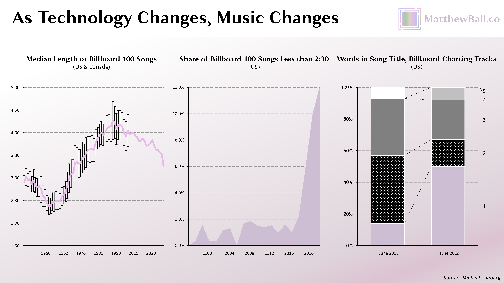

# 🌝 25年的流媒体视频历程

要理解未来，我们必须重新定义过去。事实上，“流媒体大战”并不是在2019年才开始。它们也不是在2010年代初亚马逊、Facebook、YouTube、微软和苹果进入市场时开始的。甚至不是在2007年，当时Netflix（作为流媒体服务提供商）和Hulu推出。

早在1993年，人们就可以在互联网上实时播放视频，Xerox PARC在加利福尼亚州帕洛阿尔托展示了Severe Tire Damage乐队的音乐会的第一次公开演示。两年后，第一次互联网视频通话也出现了，到了1996年，只要有美国在线和一台100美元的网络摄像头，任何美国人都可以使用此功能。1997年，DOCSIS 1.0推出，使得通过电信和付费电视电缆传送互联网数据成为可能。一年后的1998年，美国亚利桑那州凤凰城推出了第一个基于IP的电视系统。虽然这些系统不需要基于IP的传输，但是数字录像机在1999年首次出现（TiVo），使得消费者可以将实时电视记录下来并在稍后播放。类似于“Napster”但用于所有文件的点对点文件共享服务KaZaA于2001年推出，其中最为著名的是视频。

Netflix在2000年开始研发其流媒体服务。这仅仅是推出DVD订阅服务的一年半之后，但高管们预计在两十年内，流媒体将成为向全国交付“DVD”的最佳方式。这个推论是可以计算的。例如，一辆装有DVD的卡车穿过整个国家，可能具有等于一千个DVD的带宽和三天的延迟。而在平均年份里，这些值并没有改变（实际上，延迟通常由于流量而恶化）。相比之下，美国宽带的带宽、延迟和部署正在快速增长，可以计算出何时使用互联网比混合轻型运输车向用户交付DVD更加高效（和可靠）。当Netflix开始研究时，该公司估计向普通家庭传输单个标准电影需要16个小时和10美元的带宽费用。到了2003年，这个时间缩短到了6个小时和几美元。那时Netflix的计划是部署一个类似Roku的盒子，售价约为300美元，订户可以在睡觉时（或上班时）下载电影进行本地播放（而非流媒体）。最终，这些计划被放弃了。到了2005年，Netflix 决定国家宽带成本和延迟将很快足以支持标准清晰度的流媒体服务。2007年，Netflix 推出了免费的流媒体服务，同时保留 DVD 订阅服务。到了2010年，Netflix 决定其服务已经足够可靠，可以作为独立的服务提供。随后一年，亚马逊推出了“即时视频”服务以及其原创节目开发计划。

在 Netflix 开发流媒体技术的同时，另一家公司实际上在全国范围内分发流媒体视频，包括现场的地理定位视频。2002年，美国职棒大联盟推出了 MLB.TV 订阅服务，为棒球迷提供了观看数百场比赛的唯一途径。第一场比赛——洋基队对阵游骑兵队——在60个国家共有3万名观众实时收看。到了《纸牌屋》首播时，MLB.TV 已经积累了近20亿次实时流媒体观看和400万订阅者。在接下来的几年里，MLB 将其流媒体技术部门独立成 BAMTech 公司，后者成为了美国体育直播的主要技术供应商，也成为了 HBO Go 和 Now 等服务的后台。2016年，迪士尼以10亿美元的价格购买了 BAMTech 的三分之一，2017年又以16亿美元购买了其42%的股份，并在2022年完全控制该公司。

2005年，基于互联网传播的视频流媒体服务YouTube成立。到2010年，它已成为历史上最受欢迎的视频服务。同年，第一台Slingbox问世，可以将本地视频（通常是家庭的付费电视服务）编码为互联网传输的格式（即发送给用户在家外的位置）。2006年9月，苹果公司宣布推出Apple TV设备，并于2007年1月9日发布，比Netflix宣布其流媒体服务早六天，而Hulu在三月份宣布，十月份正式推出。2007年，用于用户生成内容（UGC）的直播平台Justin.TV也问世，并于2011年分拆成Twitch。2008年发布了Roku流媒体设备。

2012年，上文提到的Xbox Entertainment Studios成立。一年后，微软发布了Xbox One，其志在成为电视上所有内容的“input one”，包括付费电视，尽管该服务必须从传统的付费电视供应商购买。2013年，YouTube推出了来自标志性付费电视合作伙伴（例如国家地理频道）的付费频道，但其中大部分都未能坚持到2015年。Music.ly/TikTok成立于2014年，第一个虚拟多频道视频编程分销商（MVPD）PlayStation Vue于2015年推出。同年，YouTube还推出了其首个平台范围的订阅服务YouTube Red，使所有YouTube视频都没有广告，并包括一些高质量的原创系列，例如《眼镜蛇》Cobra Kai。到2017年，YouTube退出了原创节目制作领域（《眼镜蛇》在Netflix上找到了新家），但保持了几乎没有广告的订阅服务YouTube Premium（尽管失去了高质量的原创内容，价格却比YouTube Red高了2美元）。YouTube还推出了自己的虚拟多频道视频编程分销商（vMVPD）YouTube TV。2017年，全球最受欢迎的网站Facebook推出了Watch，并拥有自己的高预算原创节目。如前所述，Apple TV的第一个原创电视节目库也于同年问世。

在上述历史中，可以列举出十几个标志性事件，例如TV Everywhere和HBO Go在2010年推出，2013年推出了第一部签约的仅流媒体电视系列，2013年发布了Chromecast等。但重点是，在2019年被认为是“流媒体战争”开始之前，已经发生了很多事情。事实上，这已经是超过四分之一世纪的流媒体视频历史。\

<figure><figcaption></figcaption></figure>

我刚才总结的这个季度世界称为“基于获取的竞争”，这是新的娱乐技术的第一“浪潮”，是由内容传递的关键创新引发的。最明显的例子是音频行业从仅限现场表演发展到广播电台（NBC广播），然后是实体媒介（大西洋唱片），再到下载（MP3），最后是流媒体（Spotify）。这种变化包括了从付费收听到免费广告支持的收听，然后到付费购买整张专辑，然后到付费购买单曲，最后到按订阅使用付费获得无限访问上千万曲目。视频方面也大致相似，从电影发展到广播电视，然后到基础有线电视，随后是高级有线电视和VHS同时到来，最后是流媒体视频。

<figure><figcaption></figcaption></figure>

需要明确的是，媒体行业始终处于改进的过程中，因为[媒体本身就是科技](https://www.matthewball.vc/all/audiotech)。例如，流媒体比特率和音频压缩率不断提高，而电视机的分辨率（50％的美国家庭现在拥有4K电视）和刷新率也在不断提高，尽管每美元的屏幕尺寸也在增加。但是，每隔一段时间，访问内容的改进是如此根本和更好，以至于它们重新定义了媒介，产生了新的胜者，摧毁了一些旧胜者，改变了商业模式（以及随之变化的定价模式），并且无疑还改变了内容。

再回到例子上，我们可以对比从音频磁带到CD，以及从CD到数字下载，或从数字下载到流媒体的转变。从磁带到CD增加了音频质量、可用性（跳曲）、容量和空间，但商业模式或内容并没有太多改变，也没有改变谁制作和销售内容。从CD到数字下载则是一次完全的转变，导致了新设备（MP3播放器）和新卖家（iTunes），并将专辑打包拆分成单曲。1999年是CD销售的高峰，美国10.7亿音轨中99.3%是通过专辑销售的。到2014年，少于70%是通过专辑销售的，音轨总销售额下降了75%至26亿，而单曲销售额从7500万增长至12亿。点播流媒体音频是另一次革命，不仅转变了内容下载方式，而且将访问从按音轨付款转变为按所有音轨付款，版权费也从每个已购买的音轨的份额转变为所有用户流媒体播放的音轨比例份额。每一次转变都改变了“热门歌曲”的含义，以及热门歌曲的声音、结构和制作方式。付费流媒体的兴起，导致音轨的长度显著缩短（2:30的歌曲播放两次比5:00的歌曲更好听），而触摸屏搜索和基于语音的助手鼓励歌曲标题更短、更简单。

<figure><figcaption></figcaption></figure>

一段时间以来，有些人认为卫星电视会是这样的一个转变。DirecTV和Dish可以向家庭提供比有线电视提供商更多的频道，并覆盖家中的每台电视，而不需要拆卸石膏板。而且，与其他任何付费电视提供商不同，DirecTV是全国性的，几乎每个家庭都可以使用。然而，卫星视频并没有改变经济、包装或真正的电视观看核心体验。DirecTV推出三年后，DOCSIS推出了电子节目指南和更多的频道空间，随后不久是IPTV。这缩小了卫星电视的优势，而卫星电视仍在努力解释为什么值得在家中安装大型接收器碟。很明显，流媒体视频是卫星、DOCSIS和IPTV未能成为的创新。

首先，“获取浪潮”发展缓慢。需要进行大量测试，以确定哪种商业模式最佳，新的获取模式会改变什么和不会改变什么等等。获取先驱也有许多顺风顺水的机会。例如，他们的焦点是早期采用者，他们通常更懂技术、更好奇、更富有，这意味着产品可以更加复杂，其效益不太确定，价格较高。由于没有期望即将或显著的利润，缺乏利润也证实了很少的东西，而风险投资将在增长后继续投入。出于这些原因，技术和商业模式可能会被证明不可持续或劣于竞争方法，并可能会持续一段时间。

关键是，在接入阶段，增长主要通过从旧接入模型中的用户中吸收，而不是通过与新模型的领导者的直接竞争获得增长。里德·黑斯廷斯长期以来一直认为，任何新的流媒体进入者的影响都相对较小，因为90%的电视观看仍在传统付费电视系统中。将客户从那个渠道转移到OTT更为重要，而这主要依赖于市场认知和技术，而不是绿灯。在接入阶段，客户流失率也往往较低，而收购成本相对较低，内容提供相对未分化。这意味着平均客户的生命周期价值很高，并且这些客户也从惊人的价值中受益。换句话说，这对每个人来说相对容易满足。因此，这种状态不能持续太久。
